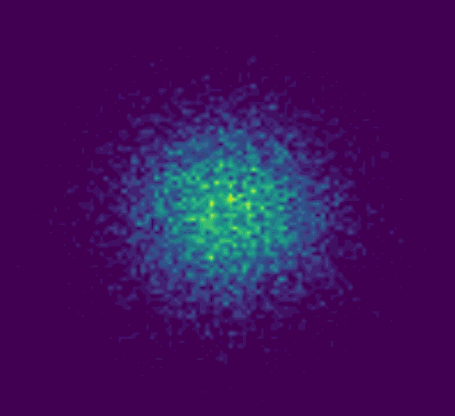
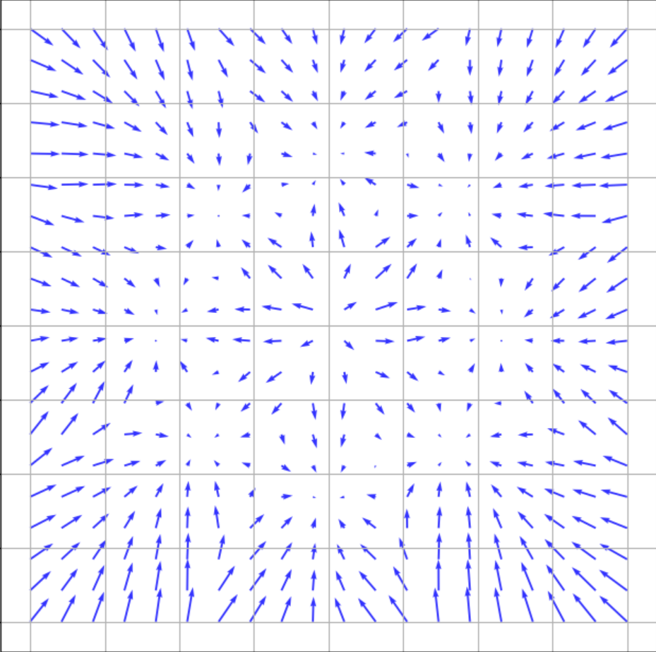
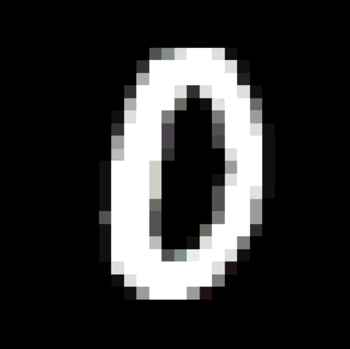

# Flow Matching: Continuous Normalizing Flows on Manifolds

This repository contains an implementation of **Flow Matching (FM)** for generative modeling. The project explores the ability of time-conditioned neural networks to learn deterministic velocity fields that transport a simple source distribution to complex target distributions and mappings between different image manifolds.

##  Overview

Flow Matching is a simulation-free approach to training Continuous Normalizing Flows (CNFs). Unlike traditional Diffusion models that rely on stochastic SDEs, Flow Matching allows for **Straight-Line Paths**, resulting in:
* **Deterministic Trajectories:** Simplified ODE integration.
* **High Efficiency:** High-quality generation with fewer integration steps.

##  Project Components

### 1. Gaussian Mixture Target
This model learns to split a single standard Gaussian source into $K=8$ distinct clusters arranged in a circular pattern.
* **Architecture:** Time-conditioned MLP with SiLU activations.

#### Visualization of Neural Network Moving Density

#### Learned Vector Field at $t = 1$

### 2. MNIST Digit Morph
A high-dimensional application of Flow Matching mapping the "0" digit manifold to the "1" digit manifold.
* **Architecture:** Time-conditioned U-Net with spatial skip-connections.

#### 0 to 1 Morph

## Implementation

### The Loss Function
The velocity field $v_\theta(x_t, t)$ is trained to minimize the Flow Matching objective:
$$\mathcal{L}_{FM} = \mathbb{E}_{t, q(x_0, x_1)} [ \| v_\theta(x_t, t) - (x_1 - x_0) \|^2 ]$$
where the probability path is defined as $x_t = t x_1 + (1-t) x_0$. This creates a constant-velocity "straight" path between the noise and the data.

### Sample Generation
To generate new samples, we solve the Ordinary Differential Equation:
$$\frac{dx}{dt} = v_\theta(x, t)$$
using an Euler integrator from $t=0$ to $t=1$.